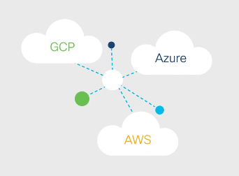

# Modem Sorunu

Cisco ile SD-WAN yapılabiliyor

SD-WAN

Software Defined WAN

SD-WAN ile ofislerdeki veri merkezlerindeki ve bulutlardaki ağ trafiğini yönetebilir ve optimize edebiliriz.

normal WAN lar ile bunu yapmak maliyetli. yazılım kullanark otomatik hale getiriyoruz.

VPN lerin kurulumu ve yönetimi , güvenlik duvarları vs SD-WAN ile yapılıyor. Bu sayede ağ cihazlarını deploy, konfigüre edip yönetebiliyoruz. Bunu tek bir merkezden sağlayabiliyoruz. Her bir cihazın yanında olmamıza gerek yok.

SD-WAN sayesinde broadband, LTE ve MPLS kullanabiliyoruz. Güncel şartlara göre en iyi ağ trafik yolunu kendisi seçebiliyor.

Bu koşullardan bazıları : bandwidth, latency, packet loss vs

SD-WAN yapan şirketler ve ürünler:

Berqnet

Cisco

Traditional WAN lar cloudlar için tasarlanmamıştı. Ofislerden veri merkezlerine kadar giden bütün trafiği - buluta giden trafik dahil - sağlarlar. Bu yüzden de yavaş çalışırlar. 

SD-WAN da ise veri merkezlerideki açık-gizli bulutlardaki ve saas servislerindeki sistemleri desteklemek için dizayn edildi.

Normal WAN lar, ağdaki bütün cihazlara kontrol fonksiyonu dağıtır Bu kompleks ve verimsizdir.

SD-WAN WAN ın basitleştirilmiş hali denebilir. Güvenlik ve bilgi gizliğinden de ödün vermemize gerek olmuyor.

Multi-WAN

Multi Wide Area Network

Bir cihazın ya da ağın birden fazla internet bağlantısını aynı anda yürütmesini sağlar. Bu sayede güvenlik, bandwith artar.

Multiwan birden fazla ISP ye bağlanabiliyoruz. 

Multiwan ile birden fazla internet bağlantısı yapabiliyoruz : DLS, kablo, hücresel veri.  

Birden fazla bağlantıya sahip olduğumuzda ise eğer bir bağlantı kaybolursa iletişim diğer bağlantıdan sağlanabilir.

SD-WAN daha gelişmiş bir teknolojiye sahiptir, birden fazla WAN ı yönetir.

Özetle, MultiWAN birden çok internet bağlantısında temel yük dengeleme ve yük devretme yetenekleri sağlarken, SD-WAN WAN bağlantısına daha gelişmiş ve akıllı bir yaklaşım sunarak kuruluşların uygulama performansını optimize etmesine, maliyetleri düşürmesine ve güvenliği artırmasına olanak tanır.

Gateway iki ya da daha fazla ağı birbirine bağlayan bir cihaz ve ağ trafiği için giriş noktası sağlıyor. Başka bir internete ya da ağa yazılım ya da donanım yoluyola erişim sağlamaya yarıyor.

Router ise bilgisayar ağları arasındaki paketleri ileten cihazdır. Layer 3 görev yapar. Birden fazla ağı bağlamak için kullanılır. Bu ağlar LAN ve WAN lar olabilir. 

Gateway → iki farklı ağa birbirine bağlar Lan and internat

Router → iki farklı aynı tipte ağı bağlar. Gateway in NAT VPN ve firewall özellikleri vardır.

Captive Portal 

Captive portal sayesinde bir wifi ağında bağlanmak istediğimizde bize kullanıcı ve şifre girmemiz isteniyor. bu sayede authentication sağlanıyor ve ağa dahil oluyoruz. 

Captive portal wifi access point inden / routerından ayrı bi yerde kurulmuştur. kullanıcı wifi ağına bağlandığında access point kullanıcın web trafiğini captive portal server ına iletir. Kullanıcı authernticate olduğunda artık internete erişebilir.

## Switch

### Avantajlar

- Switch e bağlı cihazlar arasında verimli bir veri iletimi sağlanır
- Bağlı cihazlar için birden fazla port sağlar
- Ağır ağ trafiklerinin gereksinimlerini karşılar

### Dezavantajlar

- Kablo ile bağlo olmalıdır
- Herhangi bir güvenlik sağlamaz
- Geniş konfigürasyonlar için pahalı olabilir

## Multiwan Gate

### Avantajlar

- Bandwidth geniştir
- Load balancing ve failover yetenekleri vardır.

Load balancing : Birden fazla WAN üzerine ağ trafiğinin dağıtımı işlemidir. Kaynak kullanımının optimize edilmesi ve ağ verimliğinin maksimumun elde edilmesi için yapılır. Daha önceden belirlenen kural ve algoritmalara göre de trafik bu WAN lara dağıtılır. Bu sayede herhangi tek bir bağlantı trafiğe aşırı yükleme yapmaz. Bu sayede ağın performası artar, ağda tıkanıklık olmaz ve bandwidth geniş bir şekilde kullanılabilir.

Failover : WAN bağlantısı başarısız olma durumunda ek iş yapar ve trafik otomatik olarak diğer aktif bağlantılara yönlendirilir. Bu sayede ağın bağlantısının sürekliliği sağlanır. 

### Dezavantaj

- Konfigürasyon kompleks olabilir
- Efektif olabilmesi için birden fazla WAN bağlantısı gerekir.
- Her cihaz multiwan ı desteklemeyebilir
- Güvenlik riskleri mevcuttur

## SD-WAN

### Avantaj

- Birden fazla düşük bütçeli broadband bağlantısı kullanarak WAN giderini azaltabilir.
- Ağ trafiğini yönetmek ve konfigüre etmek kolaydır.
- Gecikme az, performans yüksektir.
- Tek bir merkezden yönetilebilir.

### Dezavantaj

- Konfigüre etmek komplex olabilir, özel uzmanlık gerektirir.
- Açık internette olduğu için güvenlik sorun olabilir
- Bandwidth için sınırlar konulabilir

## Router

### Avantaj

- Firewall ve VPN gibi olanaklar sağlar
- En iyi performans verecek şekilde ağı trafiğini yönetirler
- Trafik akışını yönetmek ve güvenlik için ağı segmentlere ayırırlar
- Güvenilirdir, failover mekanizması vardır.

### Dezavantaj

- Kompleks ağlar için gereken fonksiyonlara sahip olamayabilir
- Kurmak ve yönetmek komplekstir, uzmanlık gerektirir
- Pahalıdır
- Geniş trafikleri yönetmek performansa sıkıntı çıkarır

## Access Point

### Advantages

- Kablosuz bağlantı sağlar
- İhtiyaca göre kablosuz bağlantılara ek yapılabilir
- Teknik bilgiye ihtiyaç azdır
- Diğer cihazlara göre daha uygundur

### Dezavantaj

- Aralığı sınırlıdır, sinyal gücü de fiziksel ortamdan etkilenir.
- Güvenlik riskleri mevcuttur
- Ne kadar çok cihaz bağlanırsa, performansı o kadar çok düşer.

## Mesh Topolojisi

Her bir ağ cihazı, ağdaki diğer bütün cihazlara bağlı olma durumuna mesh topolojisi adı verilir. Her bir cihaz veri alır ve gönderir. Herhangi bir merkez kontrol noktası olmadan ağ işini yapar. 

Eğer bir bağlantı düşerse, veri diğer alternatif yollardan iletilmeye çalışılır. Bu sayede ağın güvenliği kullanılabilirliği artar. Ek olarak performans ve verimlilik sağlanır. 

İki tip mesh var. Full mesh ve partial mesh

Full mesh : Her bir cihaz doğrudan olarak diğer bütün cihazlara bağlı. 

Partial mesh : Her cihaz doğrudan olarak diğer bütün cihazlara bağlı değil. 

Mesh ağları ağın güvenliği ve kullanılabilirliğini kritik olduğu durumlarda kullanılır. Mesh ağlarını yönetmek ve kurmak komplike olabilir.

## Avantajlar

- Herhangi bir yeni cihaz ekleme durumu basittir.
- Mobil ve dinamik ağ olarak kolaylıkla kullanılabilir
- Ağ başarısız olma durumunda, verinin tekrar gönderilmesi sağlanır
- Güvenlik açısından sağlam

## Dezavantaj

- Kurmak ve yönetmek kompleks
- Pahalı
- Gecikme olabilir
- Bandwidth dar olabilir

Bizim problemimiz için WAP Wireless Access Point yeterli gibi. Birden fazla WAP kullanırsak bağlantı kesilmeden kullanıcı farklı yerlerde internete bağlı kalır. Kullanıcı bir WAP tan diğer WAP a gittiğinde ağ otomatik olarak kullanıcını en yakın olduğu WAP’a yönlendilir. 

## WAP - Wireless Access Point

### Avantaj

- Kabloya ihtiyaç olmadan cihazlar ağa bağlanır.
- WAP in aralığı yettiği sürece kablosuz internet sağlanır
- Ağa ekleme/çıkarma durumu basittir.
- Ucuzdur

### Dezavantaj

- Güvenlik sıkıntısı var
- Sinyal iletimi için radio frekansı kullanır. Diğer dalgalarla çakışma yaşanabilir.
- Range sıkıntıları yaşanabilir
- Hızda sıkıntılar yaşanabilir.

Fikir olarak : Multiple WAN ve WAP ları birlikte kullanırsak sorun çözülebilirmiş gibi duruyor. 

Bir router ımız olur, Multi WAN destekleyen bir router, sonra birden fazla WAP ımız olur bunlar ethernet kablosu ya da kablosuz şekilde birbirlerine bağlanır.

İkinci fikir - Load balancing router kullanabiliriz. WPA2 Enterprise ya da 802.1X prokolleri kullanabiliriz. username ve parola ile authenticate olunabiliyor. 

Bağlantının diğer odalarda kopmaması için de Access Pointler kurulur, bu AP ler aynı SSID ve auth ayarlarına sahip olmalı. 

WAP lar ve Load balancing router ı bağlamak için 

1. Load balancing router ın gerekli konfigürasyonlarını yapmak gerekiyor. WAN bağlantılarını yapmak ve load balancing algoritmalarını kurmak yeterli olacaktır.
2. WAP ların konfigürasyonlarını yapmak gerekiyor. WAP lar hepsi aynı güvenlik ve ssid ye sahip olmalı. 
3. Ethernet kabloları ile WAP ları load balancing router a bağla. Static IP mi yoksa DHCP mi buna kullandığımız cihazlara göre karar vereceğiz.
4. VLAN gerekiyorsa VLAN ayarları yap

Load balancing router kurmak için

1. Ağ topolojisine karar ver
2. Load balancing algosuna karar ver - Round robin kullanılabilir
3. Router ı kur, load balancing kuralları koy ve virtual IP adresi al
4. Serverları kur
5. Load balancingte kullanılacak virtual IP adresleri ayarla
6. Load balancing algosunu ayarla
7. Load balancing kurallarını koy, port ve protokolleri ayarla